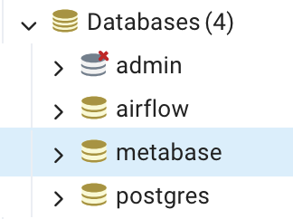

# Trabalho de Conclusão
### Pós-Graduação Lato Sensu Especialização em Análise de Big Data - Data Engineering
### Turma: LAABDDEEAD12 - Grupo: Camera Aberta

O trabalho consiste em apresentar uma solução completa de engenharia de dados usando as ferramentas que aprendemos no curso e acessando como fonte de dados a A API do OlhoVivo da SPTrans. 

O grupo optou por montar uma estrutura de dados direcionada à gestão de eficiência operacional.

Para isso, pensamos em gerar informações sobre os desvios emcontrados em termos de tempo (previsão de chegada do onibus em uma parada) e fazer a comparação com os dados encontrados que indicam quando o onibus passou pela parada efetivamente. 

Para isso, fizemos uma exploração incial dos dados coletados e montamos uma arquitetura que comtemplou os dados necessários para fazermos uma apresentação das informações.

## Arquitetura da Solução


A arquitetura consiste basicamente em:

* Docker Composer
* Jupyter Notebook (spark)
* Minio
* ClickHouse
* Metabase

### Acesso à API OlhoVivo

A SPTrans disponibilizou para desenvolvedores uma API, que pode ser acessada em:

https://www.sptrans.com.br/desenvolvedores/

Foi necessário fazer o cadastro para geração de token de acesso em: https://www.sptrans.com.br/desenvolvedores/login-desenvolvedores/


Os passos principais são:

### 1. Setup do Git

Criar diretório para clonar repositório git

```
git clone git@github.com:ftfarias/fia-trabalho.git
```

### 2. Setup do Docker Composer

Os serviços necessários estão configurados no arquivo `docker-compose.yml`, que pode ser encontrado no diretório `docker/`.

Porém, antes de subir os serviços, é necessário fazer algumas configurações iniciais:

1. criação dos diretórios do banco de dados (Postgres)

No diretório `docker/`:

Se estiver usando Windows:

```
.\script.bat
```

Se estiver usando MacOS:

```
.\script_mac.bat
```

2. Setup pgAdmin db

Subir o serviço `pgadmin` com Docker Compose:

```
docker compose up pgadmin
````

Acessar o serviço em:

* PGAdmin: [`http://localhost:5433`](http://localhost:5433/)

Credenciais:

```
Login: lab-pgadmin4@pgadmin.org
Password: admin
````
Passos:

```
Add New Server
Register > Server
General > Name: db
Connection > Hostname: db
Connection > Username: admin
Connection > Password: admin
Save password: True
Save
```

Criar os databases: 



#### Subir todos os serviços com Docker Compose

```
$ docker compose up -d
```

### Resultado esperado

```
PostgreSQL init process complete; ready for start up.

```

### Para listar os containers e portas:

```
$ docker ps
```

Depois que os serviços subirem, acessá-los nos links abaixo: (revisar)

* Airflow: [`http://localhost:8080`](http://localhost:8080)
* Spark (Jupyter Notebook): [`http://localhost:8889`](http://localhost:8889)
* Minio: [`http://localhost:9051`](http://localhost:9051)
* Metabase: [`http://localhost:3000`](http://localhost:3000)
* PGAdmin: [`http://localhost:5433`](http://localhost:5433/)
* ClickHouse: [`http://localhost:18123`](http://localhost:18123)


Para parar os serviços

```
$ docker compose down
```

### Setup do Ambiente Jupyter Notebook

*

Foi usado no projeto:

- Anaconda: 
- Python: Python 3.x
- Jupyter Notebook (conda install jupyter notebook)


### Setup do Minio

Subir os csv do diretorio gtfs para o bucket raw

### Setup de ClickHouse


### Setup do Metabase


### 