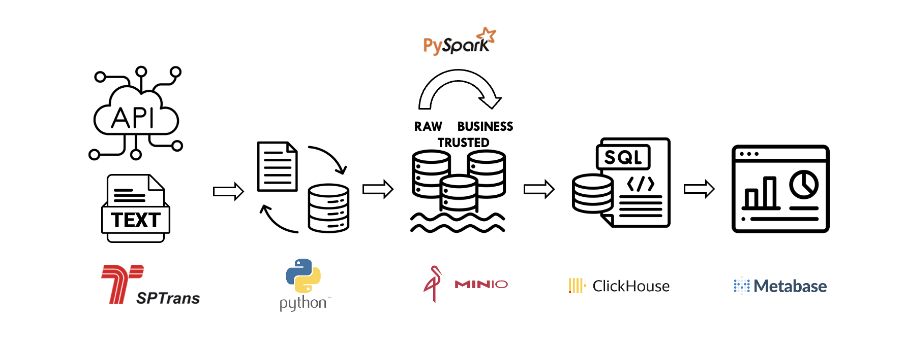

# Trabalho de Conclusão
### Pós-Graduação Lato Sensu Especialização em Análise de Big Data - Data Engineering
### Turma: LAABDDEEAD12 - Grupo: Camera Aberta

O trabalho consiste em apresentar uma solução completa de engenharia de dados usando as ferramentas que aprendemos no curso e acessando como fonte de dados a A API do OlhoVivo da SPTrans. 

O grupo optou por montar uma estrutura de dados direcionada à gestão de eficiência operacional.

Para isso, pensamos em gerar informações sobre os desvios emcontrados em termos de tempo (previsão de chegada do onibus em uma parada) e fazer a comparação com os dados encontrados que indicam quando o onibus passou pela parada efetivamente. 

Para isso, fizemos uma exploração incial dos dados coletados e montamos uma arquitetura que comtemplou os dados necessários para fazermos uma apresentação das informações.

## Arquitetura da Solução



A arquitetura consiste basicamente em:

* Docker Composer
* Jupyter Notebook
* Minio
* ClickHouse
* Metabase

### Acesso à API OlhoVivo

A SPTrans disponibilizou para desenvolvedores uma API, que pode ser acessada em:

https://www.sptrans.com.br/desenvolvedores/

Foi necessário fazer o cadastro para geração de token de acesso em: https://www.sptrans.com.br/desenvolvedores/login-desenvolvedores/

### Setup do Docker Composer

No diretório docker/

```
docker compose up
```

PGAdmin: http://localhost:5433/browser/
Airflow: http://localhost:8080/home

### Setup do Ambiente Jupyter Notebook

Foi usado no projeto:

- Anaconda: 
- Python: Python 3.x
- Jupyter Notebook (conda install jupyter notebook)


### Setup do Minio


### Setup de ClickHouse


### Setup do Metabase


